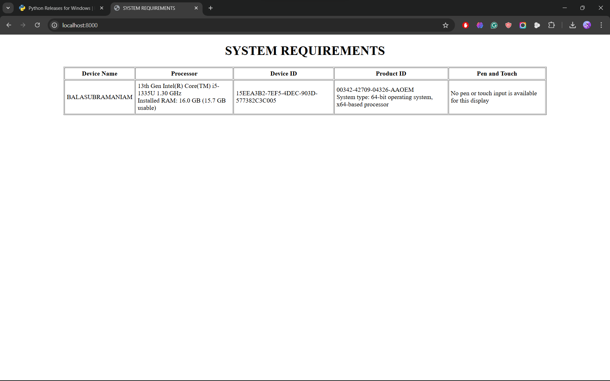

# EX01 Developing a Simple Webserver
## Date:

## AIM:
To develop a simple webserver to serve html pages and display the configuration details of laptop.

## DESIGN STEPS:
### Step 1: 
HTML content creation.

### Step 2:
Design of webserver workflow.

### Step 3:
Implementation using Python code.

### Step 4:
Serving the HTML pages.

### Step 5:
Testing the webserver.

## PROGRAM:
```
from http.server import HTTPServer, BaseHTTPRequestHandler

content = '''
<!doctype html>
<html>
<head>
    <title>SYSTEM REQUIREMENTS</title>
</head>
<body>
    <h1 style="text-align: center;">SYSTEM REQUIREMENTS</h1>
    <table border="1" cellpadding="5" style="width: 80%; margin: auto;">
        <tr>
            <th>Device Name</th>
            <th>Processor</th>
            <th>Device ID</th>
            <th>Product ID</th>
            <th>Pen and Touch</th>
        </tr>
        <tr>
            <td>BALASUBRAMANIAM</td>
            <td>13th Gen Intel(R) Core(TM) i5-1335U 1.30 GHz<br>Installed RAM: 16.0 GB (15.7 GB usable)</td>
            <td>15EEA3B2-7EF5-4DEC-903D-577382C3C005</td>
            <td>00342-42709-04326-AAOEM<br>System type: 64-bit operating system, x64-based processor</td>
            <td>No pen or touch input is available for this display</td>
        </tr>
    </table>
</body>
</html>


class MyServer(BaseHTTPRequestHandler):
    def do_GET(self):
        print("Get request received...")
        self.send_response(200) 
        self.send_header("Content-type", "text/html")       
        self.end_headers()
        self.wfile.write(content.encode())

print("This is my webserver") 
server_address = ('', 8000)
httpd = HTTPServer(server_address, MyServer)
httpd.serve_forever()
```

## OUTPUT:


## RESULT:
The program for implementing simple webserver is executed successfully.
